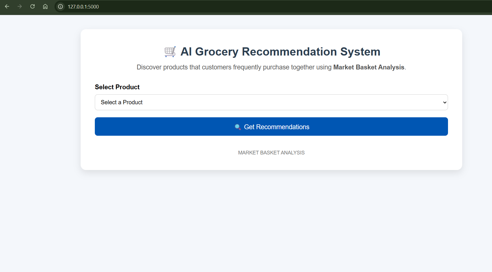
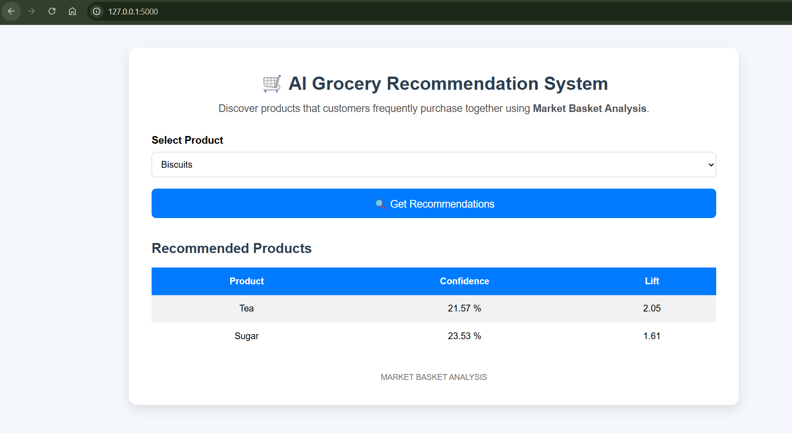
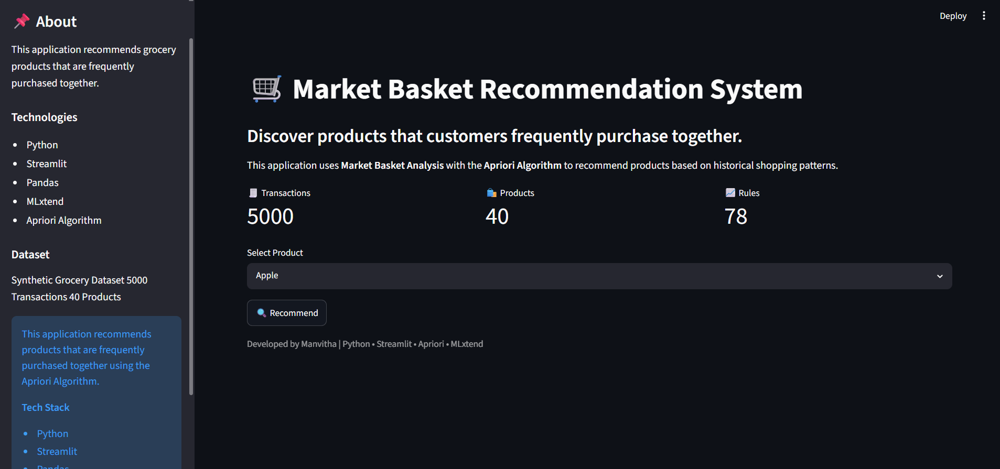
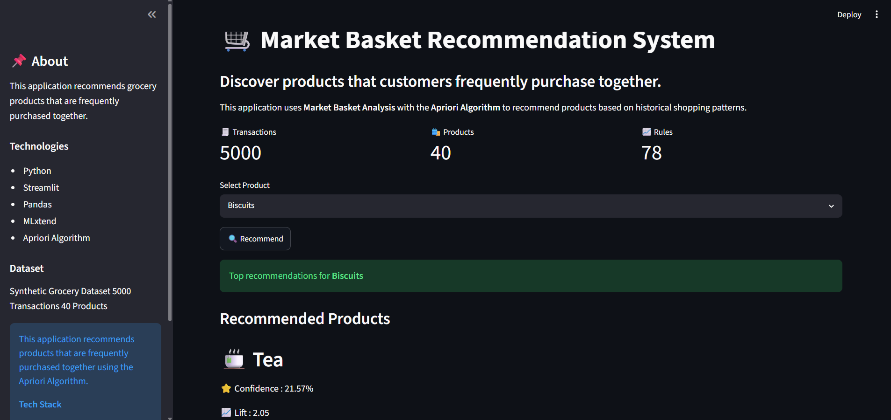

#  AI-Powered Grocery Recommendation System

##  Project Preview

### Flask Application





### Streamlit Application





An AI-powered Grocery Recommendation System built using **Market Basket Analysis** and the **Apriori Algorithm**. The application analyzes customer purchasing patterns and recommends products that are frequently bought together.

The project includes both a **Flask Web Application** and a **Streamlit Application**, making it easy to interact with the recommendation engine.

---

##  Features

- 📊 Market Basket Analysis using Apriori Algorithm
- 🛍 Product Recommendation Engine
- 📈 Association Rule Mining
- 🧾 Synthetic Grocery Dataset Generation
- 🌐 Flask Web Application
- ⚡ Streamlit Web Application
- 🎨 Responsive User Interface
- 📉 Confidence and Lift metrics for recommendations

---

## 🛠 Tech Stack

- Python
- Pandas
- MLxtend
- Flask
- Streamlit
- HTML
- CSS
- Jupyter Notebook

---

## 📂 Project Structure

```
AI-Powered-Grocery-Recommendation-System/

│── data/
│   └── grocery_dataset.csv

│── notebooks/
│   └── grocery_analysis.ipynb

│── static/
│   └── style.css

│── templates/
│   └── index.html

│── flask_app.py
│── streamlit_app.py
│── model.py
│── generate_dataset.py
│── requirements.txt
│── README.md
```

---

## ⚙️ Installation

Clone the repository

```bash
git clone https://github.com/Manvitha6714/AI-Powered-Grocery-Recommendation-System.git
```

Move into the project directory

```bash
cd AI-Powered-Grocery-Recommendation-System
```

Install dependencies

```bash
pip install -r requirements.txt
```

---

## ▶️ Run the Flask Application

```bash
python flask_app.py
```

Open your browser and visit

```
http://127.0.0.1:5000
```

---

## ▶️ Run the Streamlit Application

```bash
streamlit run streamlit_app.py
```

---

## 📊 Workflow

```
Generate Dataset
        ↓
Data Preprocessing
        ↓
Market Basket Analysis
        ↓
Apriori Algorithm
        ↓
Association Rules
        ↓
Recommendation Engine
        ↓
Flask / Streamlit Application
```

---

## 📈 Recommendation Metrics

The recommendation engine uses:

- **Support**
- **Confidence**
- **Lift**

to identify strong product associations.

---

## 📌 Future Improvements

- User Authentication
- Product Images
- Shopping Cart Integration
- Cloud Deployment
- Personalized Recommendations
- Database Integration

---

## 👩‍💻 Author

**Manvitha Cheekati**

GitHub:
https://github.com/Manvitha6714

---

## ⭐ If you like this project

Please consider giving it a ⭐ on GitHub!
